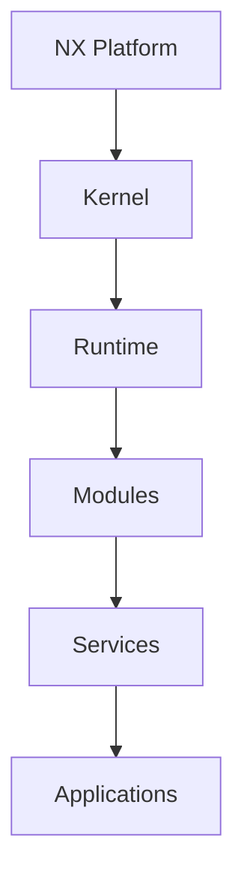
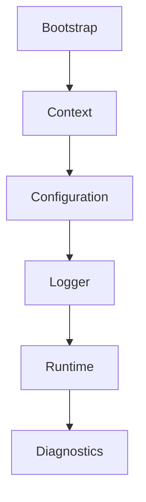
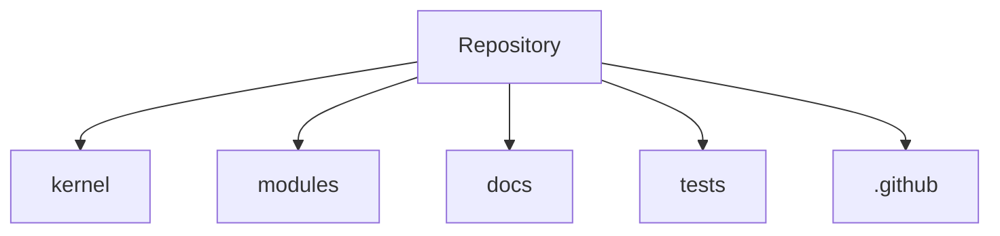

# NX Platform

> **Industrial Automation Engineering Framework**

*A modular platform for building scalable, observable, and maintainable industrial automation solutions.*

**Modular • Scalable • Observable • Extensible**

---

> [!IMPORTANT]
> **NX Platform** is currently under active development. The project follows an engineering-first approach where architecture, documentation, and implementation evolve together through incremental development sprints.

---


---

## Overview

NX Platform is an engineering framework designed to support the development of industrial automation systems through a modular, maintainable, and scalable architecture.

Rather than being a single application, NX Platform provides a foundation for building interconnected engineering components that can evolve independently while operating as a unified ecosystem. The platform is intended for telemetry, process automation, industrial communications, diagnostics, monitoring, and future engineering services.

At the center of the platform is a lightweight **Kernel**, responsible for providing the common runtime capabilities required by every subsystem. Higher-level components—including services, modules, diagnostics, and future extensions—are built on top of this foundation without creating unnecessary coupling between them.

This architecture promotes long-term maintainability, clear separation of responsibilities, predictable system evolution, and consistent engineering practices across the entire platform.

---

## Project Principles

NX Platform is guided by a small set of engineering principles that influence every architectural and implementation decision.

- **Simplicity over unnecessary complexity.**
- **Engineering before implementation.**
- **Modular by design.**
- **Consistency across the entire platform.**
- **Documentation as part of the product.**
- **Long-term maintainability over short-term convenience.**

These principles define how the project evolves and provide a common engineering mindset for every future contribution.

---

## Quick Navigation

- [Architecture Overview](#architecture-overview)
- [Repository Structure](#repository-structure)
- [Getting Started](#getting-started)
- [Project Roadmap](#project-roadmap)
- [Project Status](#project-status)
- [Documentation](#documentation)
- [Contributing](#contributing)
- [License](#license)

---

## Vision

Industrial automation systems often grow as isolated solutions that become increasingly difficult to maintain, integrate, and evolve over time.

NX Platform was created to provide a common engineering foundation that enables independent components to work together as a coherent ecosystem while preserving modularity and maintainability.

The long-term vision of the project is to establish a reusable engineering platform capable of supporting industrial applications such as telemetry, process monitoring, diagnostics, automation services, communications, and future domain-specific modules without requiring fundamental architectural changes.

Rather than solving a single problem, NX Platform aims to provide a stable foundation upon which multiple industrial solutions can be developed consistently.

---

## Engineering Philosophy

Engineering decisions within NX Platform are guided by a small set of principles intended to maximize long-term maintainability while avoiding unnecessary complexity.

### Simplicity Over Complexity

Complexity is introduced only when it provides measurable value.

Solutions should remain as simple as possible without sacrificing scalability or maintainability.

### Engineering Before Implementation

Architecture is designed before code is written.

Every significant implementation should be supported by a clear engineering decision.

### Modular by Design

Every component should have a single responsibility.

Modules should evolve independently while interacting through well-defined interfaces.

### Consistency Across the Platform

Naming conventions, repository organization, documentation standards, and engineering practices should remain consistent throughout the project.

Consistency reduces cognitive load and improves long-term maintainability.

### Documentation as Part of the Product

Documentation is considered a core deliverable rather than a secondary artifact.

Every architectural decision, module, and engineering process should be documented with the same level of quality as the implementation itself.

### Long-Term Maintainability

Short-term optimizations should never compromise the long-term evolution of the platform.

Engineering decisions should favor readability, predictability, and sustainability over temporary convenience.

---

## Key Features

NX Platform is designed around a set of core capabilities that provide a stable engineering foundation for future development.

| Capability | Description |
|------------|-------------|
| **Modular Architecture** | Independent components designed with clear responsibilities and minimal coupling. |
| **Lightweight Kernel** | Core runtime responsible for platform initialization and shared services. |
| **Configuration Management** | Centralized configuration model supporting consistent system behavior. |
| **Diagnostics** | Built-in mechanisms for health monitoring, reporting, and troubleshooting. |
| **Logging Infrastructure** | Unified logging services across all platform components. |
| **Extensible Modules** | New capabilities can be added without modifying the platform core. |
| **Engineering Documentation** | Documentation maintained as a first-class engineering artifact. |
| **Scalable Foundation** | Architecture prepared to support future runtimes, services, and industrial applications. |

> [!NOTE]
> The list above represents the intended architectural capabilities of NX Platform. Individual features may be introduced incrementally as the project evolves through future development sprints.

---

## Architecture Overview

NX Platform follows a layered and modular architecture designed to maximize maintainability, extensibility, and clear separation of responsibilities.

Instead of concentrating all functionality into a single application, the platform is organized as a collection of independent components that collaborate through well-defined responsibilities. This approach allows the platform to evolve incrementally while preserving architectural stability.

The architecture can be understood from four complementary perspectives.

---

### Platform Architecture

The highest level of the platform is composed of six major layers.



The **Kernel** provides the common foundation for the platform.

The **Runtime** coordinates platform execution.

**Modules** implement reusable capabilities.

**Services** expose business and infrastructure functionality.

**Applications** consume the platform to solve specific engineering problems.

---

### Kernel Architecture

The Kernel is intentionally lightweight.

Its responsibility is to initialize the platform and provide the common services required by every component.



Each subsystem has a clearly defined responsibility, minimizing coupling and facilitating future evolution.

---

### Repository Architecture

The logical architecture is reflected directly in the repository structure.



Maintaining alignment between repository organization and software architecture improves discoverability, simplifies navigation, and reduces long-term maintenance costs.

---

### Engineering Workflow

NX Platform is developed using an engineering-first workflow.

Every significant contribution follows the same lifecycle before becoming part of the project.


This workflow ensures that architectural decisions, documentation, implementation, and quality evolve together instead of independently.

The engineering process is considered part of the platform architecture because it directly influences the quality, consistency, and long-term sustainability of the project.

## Repository Structure

The repository is organized to reflect the architectural boundaries of the platform.

Each top-level directory has a single responsibility, allowing the project to scale without compromising clarity or maintainability.

```text
NX-Platform/
│
├── .github/            # GitHub configuration, workflows, templates
├── docs/               # Engineering documentation
├── kernel/             # Core platform runtime
├── modules/            # Independent platform modules
├── output/             # Generated artifacts
├── templates/          # Reusable project templates
├── tests/              # Validation and testing
│
├── nx.ps1              # Platform entry point
├── README.md
├── CHANGELOG.md
├── CONTRIBUTING.md
└── LICENSE
```

---

### Directory Responsibilities

| Directory | Responsibility |
|-----------|----------------|
| **.github/** | Repository automation, issue templates, pull request templates, and continuous integration workflows. |
| **docs/** | Architecture documentation, engineering specifications, guides, ADRs, and reference material. |
| **kernel/** | Core runtime components shared across the entire platform. |
| **modules/** | Independent functional modules that extend the platform without modifying the Kernel. |
| **output/** | Generated reports, exports, and build artifacts produced by development or tooling. |
| **templates/** | Reusable templates for documentation, engineering processes, and project assets. |
| **tests/** | Unit, integration, and validation tests for the platform. |

---

### Repository Design Principles

The repository follows a set of structural principles intended to preserve consistency as the project evolves.

- Every directory has a clearly defined responsibility.
- Source code and documentation evolve independently while remaining closely aligned.
- Generated artifacts are isolated from source files.
- Engineering documentation is versioned together with the implementation.
- Repository organization mirrors the logical software architecture whenever possible.

These principles reduce cognitive overhead, simplify navigation, and improve long-term maintainability.

---

### Repository Evolution

The current repository represents the foundation of NX Platform.

As new capabilities are introduced, additional directories may be added, provided they preserve the existing architectural principles and maintain a single, well-defined responsibility.

Repository growth should be intentional rather than organic, ensuring that every structural change contributes to the clarity and scalability of the platform.

---

## Getting Started

This section provides the minimum steps required to begin working with NX Platform.

Detailed installation, development, and deployment guides are available in the project documentation.

---

### Prerequisites

Before working with NX Platform, ensure that the following tools are available.

| Requirement | Recommended Version |
|-------------|--------------------:|
| PowerShell | 7.0 or newer |
| Git | Latest stable release |
| Visual Studio Code | Latest stable release |

Additional development tools may be required as the platform evolves.

---

### Clone the Repository

Clone the repository using Git.

```bash
git clone https://github.com/<organization>/NX-Platform.git
cd NX-Platform
```

---

### Verify the Repository

Confirm that the repository has been cloned successfully.

```text
NX-Platform/
├── kernel/
├── modules/
├── docs/
├── tests/
└── nx.ps1
```

If the repository structure matches the expected layout, the project is ready for use.

---

### First Execution

NX Platform is initialized through the platform entry script.

```powershell
./nx.ps1 version
```

A successful execution should display the current platform version together with basic runtime information.

As the platform evolves, additional commands and services will become available through the same entry point.

---

### Explore the Documentation

Once the repository is running, continue with the engineering documentation to understand the architecture and development workflow.

Recommended reading order:

1. Architecture Overview
2. Documentation Guides
3. Contributing Guide
4. Architecture Decision Records (ADR)

---

### Next Steps

After verifying that the platform starts correctly, contributors are encouraged to:

- Review the engineering documentation.
- Understand the repository organization.
- Follow the established development workflow.
- Explore the Kernel architecture before implementing new functionality.

The objective is to understand the platform before extending it, ensuring that every contribution remains consistent with the project's engineering principles.

---

## Project Status

NX Platform is currently in the early stages of development.

The primary objective of the current phase is to establish a robust engineering foundation before introducing higher-level platform capabilities.

Current development priorities include:

- Kernel foundation.
- Engineering standards.
- Repository organization.
- Documentation infrastructure.
- Development workflow.
- Continuous integration foundation.

The project follows an incremental engineering approach where each capability is fully designed, documented, implemented, and reviewed before expanding into new functional areas.

---

## Development Roadmap

The roadmap is organized around platform capabilities rather than individual features.

This approach emphasizes architectural evolution instead of implementation milestones.

| Phase | Capability | Status |
|------|------------|:------:|
| Phase 1 | Engineering Foundation | ✅ |
| Phase 2 | Kernel Foundation | 🚧 |
| Phase 3 | Runtime Services | ⏳ |
| Phase 4 | Module Framework | ⏳ |
| Phase 5 | Diagnostics & Logging | ⏳ |
| Phase 6 | Configuration Management | ⏳ |
| Phase 7 | Platform Services | ⏳ |
| Phase 8 | Automation Components | ⏳ |
| Phase 9 | Industrial Integrations | ⏳ |
| Phase 10 | Production Readiness | ⏳ |

---

### Long-Term Vision

The long-term objective of NX Platform is to become a reusable engineering platform capable of supporting multiple industrial software solutions without requiring major architectural redesign.

Future platform capabilities may include:

- Industrial telemetry.
- Process automation.
- Device communications.
- Monitoring services.
- Diagnostics.
- Data acquisition.
- Engineering tools.
- Domain-specific modules.

The architecture is intentionally designed to support this evolution while preserving modularity and maintainability.

---

### Release Strategy

NX Platform follows an incremental release strategy.

Rather than delivering large feature batches, the platform evolves through small engineering increments that complete an entire development lifecycle:

1. Design Review
2. Engineering Specification
3. Implementation
4. Engineering Review
5. Integration

Every release is expected to improve both the implementation and the engineering quality of the platform.

---

### Current Focus

The current development focus is centered on establishing the Kernel as the stable foundation for all future platform components.

Once the Kernel reaches architectural stability, development will progressively expand toward runtime services, extensible modules, engineering tooling, and industrial applications.

---

## Documentation

Comprehensive engineering documentation is maintained alongside the source code and evolves together with the platform.

The documentation is organized into dedicated sections covering architecture, engineering standards, development guides, templates, and architectural decisions.

Key documentation includes:

- Architecture Documentation
- Engineering Guides
- Architecture Decision Records (ADR)
- Development Standards
- Project Templates

Every significant engineering decision should be documented before implementation whenever practical.

---

## Contributing

Contributions are welcome and encouraged.

To ensure consistency across the project, all contributions should follow the established engineering workflow, documentation standards, and development practices.

Before submitting changes, please review the project's contribution guidelines.

See **CONTRIBUTING.md** for the complete contribution process.

---

## License

NX Platform is distributed under the MIT License.

The license allows the platform to be used, modified, and distributed while preserving the original copyright notice.

For complete licensing information, see the **LICENSE** file included in this repository.

---

## Acknowledgments

NX Platform is built around the belief that high-quality industrial software begins with disciplined engineering rather than isolated implementation.

The project combines software architecture, engineering documentation, modular design, and long-term maintainability into a single development philosophy.

Every component, document, and engineering decision contributes to building a platform intended to evolve through consistency, simplicity, and continuous improvement.

---

## Final Notes

Thank you for your interest in NX Platform.

Whether you are exploring the project, reviewing its architecture, or contributing to its development, your time and effort are appreciated.

We hope this repository serves not only as a software project, but also as an example of disciplined engineering practices applied to industrial software development.

