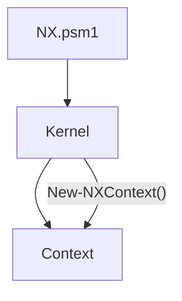
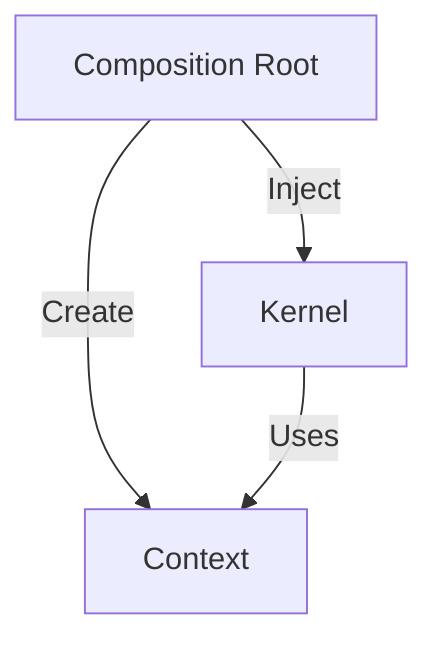

# ADR-0002 — Context Lifecycle Owned by Composition Root

| Campo | Valor |
|-------|--------|
| **ADR** | ADR-0002 |
| **Título** | Context Lifecycle Owned by Composition Root |
| **Estado** | Accepted |
| **Fecha** | 2026-07-21 |
| **Sprint** | K1.2 |
| **Autores** | NX Platform Engineering Team |
| **Proyecto** | NX Platform Kernel |

---

# Resumen

Se establece que el **Composition Root** (`NX.psm1`) es el único responsable de construir el grafo de dependencias de la plataforma.

Como consecuencia, el **Context** deja de ser creado por `Kernel.psm1` y pasa a ser instanciado, registrado e inyectado desde el Composition Root.

Esta decisión elimina dependencias implícitas entre módulos, fortalece la arquitectura modular y consolida el patrón de Dependency Injection dentro de NX Platform.

---

# Contexto

Durante el Sprint **K1.2** se realizó la estabilización del proceso de inicialización del Kernel.

Inicialmente se detectó un error durante la ejecución de:

```powershell
Start-NX -Command version
```

El síntoma observado fue:

```text
The term 'New-NXContext' is not recognized...
```

La investigación pasó por varias hipótesis:

1. Error de sintaxis.
2. Error de exportación del módulo.
3. Error en el orden de importación.
4. Problema de resolución de módulos anidados.

Después de validar cada hipótesis mediante evidencia de ejecución, se determinó que el problema no era la disponibilidad del módulo sino la responsabilidad arquitectónica asignada al Kernel.

---

# Problema

El Kernel creaba directamente el Context mediante:

```powershell
New-NXContext
```

Esto implicaba que:

- Kernel conocía la implementación de Context.
- Existía una dependencia implícita.
- El Composition Root no construía completamente el grafo de objetos.
- La creación de servicios estaba distribuida entre distintos módulos.

Lo anterior violaba los principios de diseño definidos para NX Platform.

---

# Alternativas evaluadas

## Opción A

### Importar Context desde Kernel

```powershell
Import-Module Context.psm1
```

### Resultado

Rechazada.

### Motivos

- Acoplamiento directo entre módulos.
- Mayor dependencia interna.
- Kernel deja de ser un orquestador puro.

---

## Opción B

### Exportar New-NXContext desde NX.psm1

### Resultado

Rechazada.

### Motivos

- Exposición innecesaria de servicios internos.
- Rompe encapsulación.
- Incrementa la superficie pública del módulo.

---

## Opción C

### Composition Root crea e inyecta Context

Proceso:

```text
NX.psm1

↓

New-NXContext

↓

Register Context

↓

Start-NXKernel(Context)
```

### Resultado

Aceptada.

---

# Decisión

Se adopta la **Opción C**.

El ciclo de vida del Context será responsabilidad exclusiva del Composition Root.

Las responsabilidades quedan definidas de la siguiente manera:

## NX.psm1

Responsabilidades:

- Crear Context.
- Registrar Context.
- Construir el grafo de dependencias.
- Inyectar Context en Kernel.

## Kernel.psm1

Responsabilidades:

- Consumir Context.
- Ejecutar comandos.
- Administrar el flujo de ejecución.

El Kernel **no debe crear servicios**.

---

# Arquitectura

## Antes



---

## Después



---

# Principios aplicados

## Composition Root

Toda dependencia debe construirse desde un único punto de entrada.

---

## Dependency Injection

Las dependencias se reciben.

No se crean internamente.

---

## Single Responsibility Principle

Kernel administra ejecución.

Composition Root administra construcción.

Cada componente mantiene una única responsabilidad.

---

## Separation of Concerns

La construcción de servicios queda completamente separada de la ejecución del Kernel.

---

# Implementación

Se realizaron los siguientes cambios.

## NX.psm1

- Creación explícita de Context.
- Registro del servicio Context.
- Inyección del objeto Context hacia Kernel.

---

## Kernel.psm1

- Eliminación de:

```powershell
New-NXContext
```

- Incorporación del parámetro:

```powershell
-Context
```

- Consumo exclusivo del objeto recibido.

---

# Validación

Las siguientes pruebas fueron ejecutadas satisfactoriamente.

```powershell
Import-Module .\NX.psm1 -Force
```

Resultado

PASS

---

```powershell
.\nx.ps1 version
```

Resultado

PASS

---

```powershell
.\nx.ps1 context
```

Resultado

PASS

---

```powershell
Start-NX -Command version
```

Resultado

PASS

---

```powershell
Start-NX -Command context
```

Resultado

PASS

---

No se detectaron incidencias posteriores al refactor.

---

# Consecuencias

## Beneficios

- Dependencias explícitas.
- Mayor desacoplamiento.
- Arquitectura consistente.
- Mejor capacidad de pruebas.
- Mayor mantenibilidad.
- Composition Root completamente implementado.

---

## Costos

- Cambio de firma en Start-NXKernel.
- Refactor mínimo del flujo de inicialización.

No se detectaron impactos negativos sobre módulos consumidores.

---

# Impacto

Esta decisión establece una regla permanente para NX Platform.

**Ningún módulo interno deberá crear dependencias compartidas.**

Toda dependencia de plataforma deberá ser:

1. Construida por el Composition Root.
2. Registrada durante el Bootstrap.
3. Inyectada explícitamente al consumidor.

---

# Relación con otros documentos

- EN-0001 — PSCustomObject Parameter Binding
- ENG-004 — PowerShell Engineering Guidelines
- Sprint K1.2 Closure

---

# Estado Final

**Accepted**

Esta ADR entra en vigor a partir del Sprint **K1.2** y deberá ser considerada una norma arquitectónica para todos los módulos futuros del proyecto NX Platform.