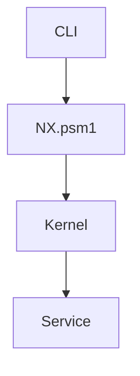

# 06 - Documentation Standard

**Document ID:** ENG-006
**Version:** 1.0.0
**Status:** Approved
**Last Updated:** 2026-07-20

---

# Purpose

This document defines the official documentation standards for NX Platform.

Documentation is considered a first-class engineering artifact.

Every implementation that changes the behavior, architecture, interfaces,
or workflows of the platform shall include the corresponding documentation update.

Code and documentation must evolve together.

---

# Documentation Principles

Documentation shall be:

- Accurate
- Complete
- Maintainable
- Versioned
- Discoverable
- Actionable

Outdated documentation is considered a defect.

---

# Documentation Hierarchy

NX Platform documentation is organized into the following hierarchy.

```

Engineering Standards

↓

Architecture

↓

ADRs

↓

Modules

↓

API

↓

Testing

↓

Operations

↓

User Documentation

```

Each level references the level above it.

---

# Documentation Categories

## Engineering

Defines project-wide standards.

Location

```
docs/engineering/
```

Examples

```
Architecture Standard

Coding Standard

Testing Standard

Module Standard
```

---

## Architecture

Describes the overall platform design.

Location

```
docs/architecture/
```

Contents

- System overview
- Diagrams
- Layers
- Responsibilities
- Data flow
- Service interactions

---

## Architecture Decision Records (ADR)

Records significant architectural decisions.

Location

```
docs/adr/
```

Each ADR shall include

- Context
- Decision
- Consequences
- Alternatives Considered
- Status

---

## Module Documentation

Each module shall include a dedicated README.

Location

```
Module/

README.md
```

Minimum contents

- Purpose
- Responsibilities
- Public API
- Dependencies
- Examples
- Limitations

---

## API Documentation

Every exported command shall be documented.

Example

```
Start-NX

Get-NXVersion

Register-NXService
```

Documentation shall include

- Parameters
- Return values
- Examples
- Exceptions
- Notes

---

## Testing Documentation

Every Sprint shall include

- Executed tests
- Results
- Evidence
- Known issues

Location

```
docs/testing/
```

---

## Operations Documentation

Documents operational procedures.

Examples

Installation

Deployment

Backup

Recovery

Monitoring

Maintenance

---

## User Documentation

Documents intended for end users.

Examples

CLI Reference

Configuration Guide

Tutorials

FAQ

---

# Documentation Triggers

Documentation must be updated whenever

- architecture changes
- public API changes
- configuration changes
- module responsibilities change
- workflows change
- deployment changes

No implementation is complete until documentation reflects the new behavior.

---

# Documentation Ownership

Every contributor is responsible for updating documentation associated
with the implemented change.

Documentation ownership is shared.

---

# Markdown Standards

Documentation shall use

- Markdown
- Relative links
- Consistent headings
- Tables where appropriate
- Mermaid diagrams when beneficial

Avoid proprietary formats unless required.

---

# Mermaid Diagrams

Preferred for

- Architecture
- Workflows
- Sequence diagrams
- State machines
- Dependencies

Example



Diagrams shall remain synchronized with the implementation.

---

# Images

Images should be used only when they improve understanding.

Preferred formats

- SVG
- PNG

Every image shall include

- Title
- Description
- Source (if external)

---

# Cross References

Documents should reference related documents.

Example

```
See:

ENG-002 Architecture Standard

ADR-0003 Service Registry

Bootstrap README
```

Avoid duplicated explanations.

Reference instead.

---

# Versioning

Documentation shall evolve together with the source code.

Every significant revision should update

- Version
- Last Updated
- Change Summary (when applicable)

---

# Review Checklist

Before approving documentation verify

✓ Technically correct

✓ Up to date

✓ Consistent with implementation

✓ Links valid

✓ Diagrams updated

✓ Grammar reviewed

✓ References updated

---

# Required Documentation Per Module

Every module shall contain

```
Module/

README.md

Examples/

Tests/

Docs/
```

README shall describe

- Purpose
- Responsibilities
- Public API
- Dependencies
- Initialization
- Examples
- Limitations

---

# Sprint Documentation

Every Sprint shall produce

- Objectives
- Scope
- Implemented Features
- Testing Evidence
- Known Issues
- Next Steps

Location

```
docs/sprints/
```

---

# Release Documentation

Every release shall include

- Release Notes
- Breaking Changes
- Migration Guide (if applicable)
- Fixed Issues
- Known Limitations

Location

```
docs/releases/
```

---

# Documentation Quality

Good documentation answers

- What?
- Why?
- How?
- When?
- Who is responsible?

Documentation should explain intent rather than repeat the code.

---

# Documentation Review Policy

Documentation shall be reviewed together with the code.

A Pull Request is not complete if the associated documentation is missing or outdated.

---

# Engineering Philosophy

Documentation is part of the software.

Well-documented systems are easier to maintain,
review,
extend,
and operate.

Future engineers should understand the platform through its documentation
before reading its implementation.